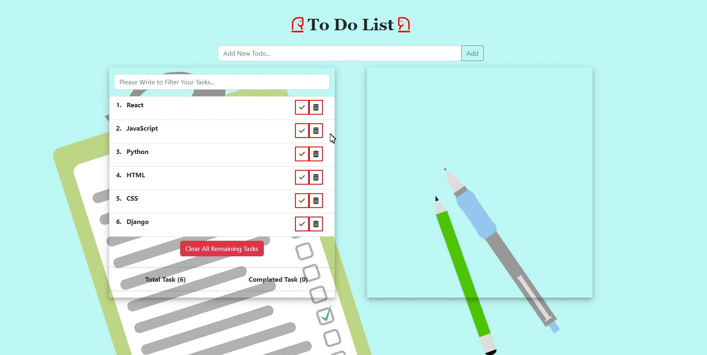
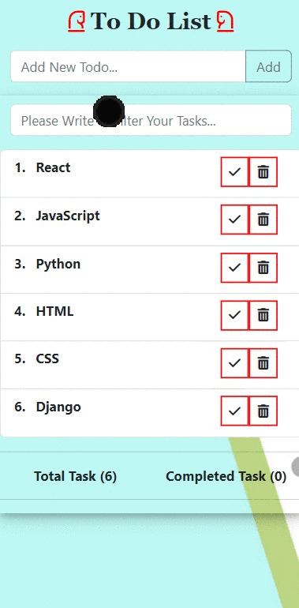

# To Do Project with React

## Description

Project aims to create a to do list app using React JavaScript Library. This project will help you to understand useState and useEffect hooks and also probs and state definitions. Furthermore, you will notice how components changed the expected outcome. 

## Project Skeleton

```
-To-Do-Places(folder)
|
|----readme.md       
|----images       
SOLUTION
├── public
│     └── index.html
├── src
│    ├── components
│    │       ├── combinator
│    │       │     └── Combinator.jsx
│    │       ├── completed_tasks
│    │       │     ├── CompletedTasks.jsx
│    │       |── deleted_tasks
│    │       |      ├── Deleted_tasks.jsx
│    │       |      └── deleted_tasks.scss
│    │       |── header
│    │       |      └── Header.jsx
│    │       |      └── header.scss
│    │       |── list
│    │       |      └── list.jsx
│    │       |      └── list.scss
│    │       └── to-do-add
│    │              └── to-do-add.jsx
│    │              └── to-do-add.scss
│    ├── App.js
│    ├── App.css
│    ├── index.js
│    └── index.css
├── package.json
└── yarn.lock
```


## Objective

Build a To DO App using ReactJS.

### At the end of the project, following topics are to be covered;

- HTML

- CSS

- JS

- ReactJS

- Sass

### At the end of the project, students will be able to;

- improve coding skills within HTML & CSS & JS & ReactJS.

- use git commands (push, pull, commit, add etc.) and Github as Version Control System.

🔗 To see live version 🎯https://tal58.github.io/to_do_withReact/


**<p align="center">&#9786; Happy Coding &#9997;</p>**

<br><br>
🌐 The desktop and mobile versions of the web page are as follows;🧭
<br><br>

## 🖥️Desktop version
<br>

<br>
<br>
<br>
<br>
<br>
<br>
<br>
<br>
<br>
<br><br><br><br><br><br><br><br><br>


## 📱Mobile version
<br>

<br>
<br>
<br>
<br>
<br>
<br>
<br>
<br>
<br>
<br><br><br><br><br><br><br><br><br>
